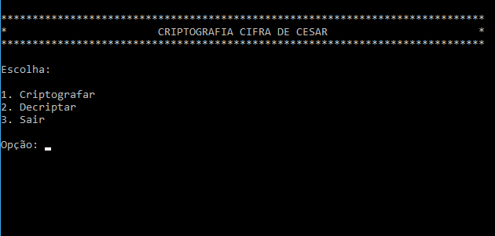
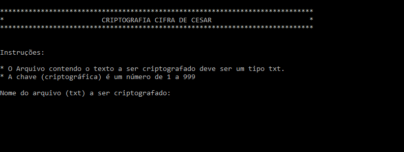
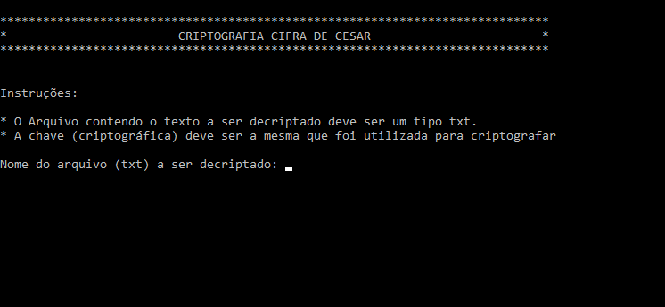

# criptografia-cifra-de-cesar
Um programa em C, que encripta e decripta textos no formato txt, baseado no método de criptografia da cifra de césar.

## A Cifra de César

A [Cifra de César](https://pt.wikipedia.org/wiki/Cifra_de_C%C3%A9sar) é uma das técnicas de criptografia mais simples e conhecidas. É um tipo de cifra de substituição, que opera de acordo com um sitema pré-definido de substituição, em que cada letra do texto é substituída por uma letra ou um símbolo diretamente. O nome do método existe em homenagem à Julio César, que usou em sua correpondência privada.

## Instalação
Para instalar, basta clonar o repositório ou baixar o código, compilar o fonte e rodar.

```bash
$ git clone git@github.com:edigar/criptografia-cifra-de-cesar.git
$ cd criptografia-cifra-de-cesar
```

### Windows
Para compilar e rodar no Windows, basta você utilizar o compilador de sua preferência para compilar o fonte em cifradecesar.c ou se preferir, pode utilizar um editor de código que tenha a função compilar.
Duas sugestões são o [DevC++](https://www.bloodshed.net/dev/devcpp.html "Download DevC++") ou o [CodeBlocks](http://www.codeblocks.org/ "CodeBlocks"), assim abra o fonte no seu editor preferido e compile.

Uma vez tendo compilado o fonte, basta executar o arquivo exe gerado.

### Linux
Para compilar no linux, você precisará ter o compilador instalado. Se não tiver, uma opção é o gcc. Para instalá-lo e compilar o fonte, faça como abaixo:

```bash
$ apt-get install gcc
$ gcc cifradecesar.c -o cifradecesar
```

Tendo compilado, basta executar a aplicação pelo prompt usando ./
```bash
$ ./cifradecesar
```

### Para leigos ou apressados
Caso não queira ver o fonte ou mesmo compilar o código, mas somente usar a aplicação, basta efetuar o download do zip, descompactar e executar os compilados que estão na pasta binaries. Nesta pasta você encontará um binário compilado no Windows 10 e um binário compilado no Linux Mint (Parecido com Ubuntu).

Caso só queira usar, basta guardar o binário e se livrar do resto.

Para executar a aplicação no *Windows*, execute o arquivo cifradecesar.exe, localizado na pasta binaries, com duplo click.

Para executar a aplicação no *Linux*, execute o arquivo cifradecesar, também localizado na pasta binaries pelo prompt de comandos.
```bash
$ cd binaries
$ ./cifradecesar
```

## Uso

Super simples de usar, basta seguir as orientações nas instruções, dentro do próprio prograna, mas consiste de 1 menu com 3 opções: Criptografar, Decriptar e Sair.

Tenha o seu texto em um arquivo do tipo txt (com extensão .txt) no mesmo diretório que o programa ou acrescente o caminho (path) para o arquivo ao informar o nome. Informe o nome do arquivo (com o caminho, caso esteja em outro diretório) **sem a extensão**, quando solicitado e ele gerará um arquivo, também do tipo txt com o conteúdo encriptado ou decriptado, dependendo da opção.

Não esqueça-se que para decriptar um texto criptografado por essa cifra, deve utilizar a mesma chave, representado por um número.

### Telas





